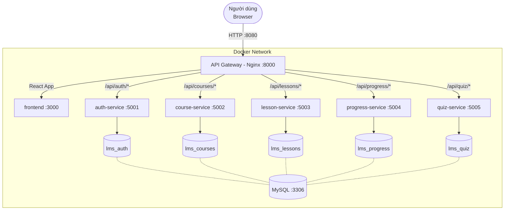

# LMS — Learning Management System

> Hệ thống quản lý học tập trực tuyến theo kiến trúc Microservices. Học viên có thể duyệt khóa học, xem bài giảng video, theo dõi tiến độ và làm bài kiểm tra. Giáo viên tạo và quản lý toàn bộ nội dung khoá học.

> **Mới vào repo?** Xem [`GETTING_STARTED.md`](GETTING_STARTED.md) để được hướng dẫn thiết lập và quy trình làm việc.

---

## Thành viên nhóm

| Họ tên | MSSV | Vai trò | Đóng góp |
|--------|------|---------|----------|
|        |      | Gateway + Auth Service | |
|        |      | Course Service + Lesson Service | |
|        |      | Quiz Service + Progress Service | |

---

## Quy trình nghiệp vụ

Hệ thống tự động hoá quy trình học trực tuyến:

- **Domain**: Giáo dục trực tuyến (E-Learning)
- **Actors**: Học viên (xem bài, làm quiz) · Giáo viên (tạo nội dung, upload video)
- **Luồng chính**: Đăng ký → Đăng nhập → Chọn khoá học → Xem video → Lưu tiến độ → Làm bài kiểm tra → Nhận kết quả

> Chi tiết: [`docs/analysis-and-design.md`](docs/analysis-and-design.md) · [`docs/analysis-and-design-ddd.md`](docs/analysis-and-design-ddd.md)

---

## Kiến trúc



| Component | Trách nhiệm | Tech Stack | Port |
|-----------|-------------|------------|------|
| **Frontend** | Giao diện React SPA | React 19, TypeScript, Tailwind CSS v4 | 3000 |
| **Gateway** | Routing, rate limiting, CORS, gzip | Nginx Alpine | 8000 (expose: 8080) |
| **auth-service** | Đăng ký, đăng nhập, JWT | Python, FastAPI | 5001 |
| **course-service** | CRUD khóa học | Python, FastAPI | 5002 |
| **lesson-service** | Bài học, upload & stream video | Python, FastAPI | 5003 |
| **progress-service** | Theo dõi tiến độ học | Python, FastAPI | 5004 |
| **quiz-service** | Bài kiểm tra, chấm điểm tự động | Python, FastAPI | 5005 |

> Tài liệu đầy đủ: [`docs/architecture.md`](docs/architecture.md)

---

## Chạy dự án

```bash
# Clone repo và cấu hình môi trường
git clone <repo-url>
cd <project-folder>
cp .env.example .env

# Build và khởi động toàn bộ hệ thống
docker compose up --build
```

Truy cập ứng dụng tại: **http://localhost:8080**

### Kiểm tra health

```bash
curl http://localhost:8080/api/health          # Gateway
curl http://localhost:8080/api/auth/health     # Auth Service
curl http://localhost:8080/api/courses/health  # Course Service
curl http://localhost:8080/api/lessons/health  # Lesson Service
curl http://localhost:8080/api/progress/health # Progress Service
curl http://localhost:8080/api/quiz/health     # Quiz Service
```

---

## Tài liệu

| Tài liệu | Mô tả |
|----------|-------|
| [`docs/architecture.md`](docs/architecture.md) | Kiến trúc hệ thống, pattern selection, sơ đồ |
| [`docs/analysis-and-design.md`](docs/analysis-and-design.md) | Phân tích & thiết kế theo hướng SOA/Erl |
| [`docs/analysis-and-design-ddd.md`](docs/analysis-and-design-ddd.md) | Phân tích & thiết kế theo hướng DDD |
| [`gateway/readme.md`](gateway/readme.md) | Cấu hình gateway, routing, rate limiting |
| `services/*/readme.md` | README riêng của từng microservice |

---

## License

Dự án sử dụng [MIT License](LICENSE).
