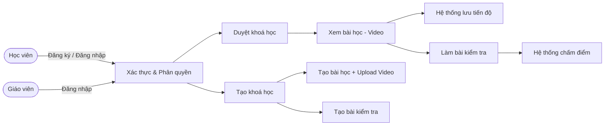
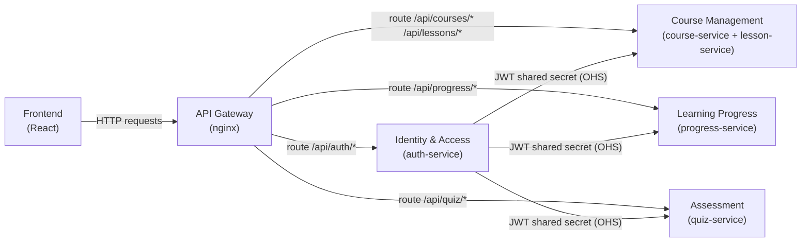
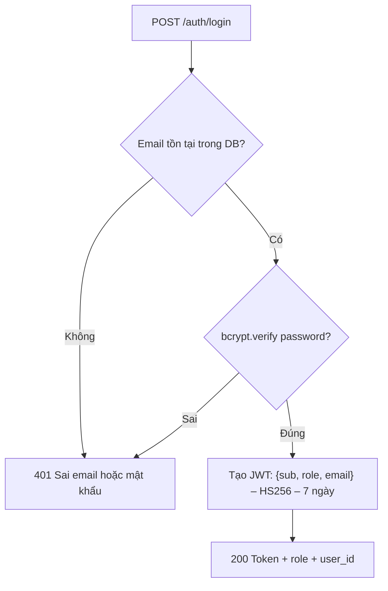
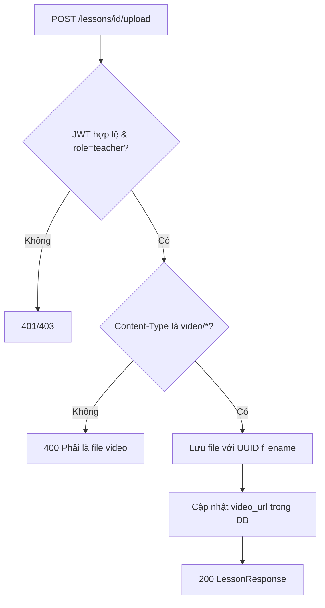
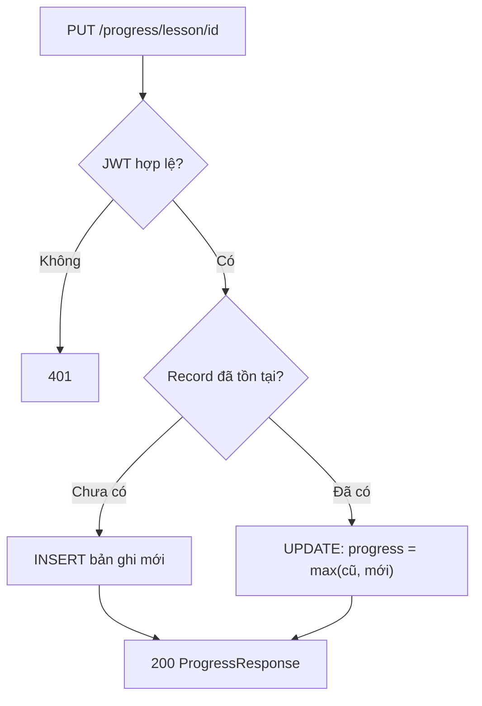
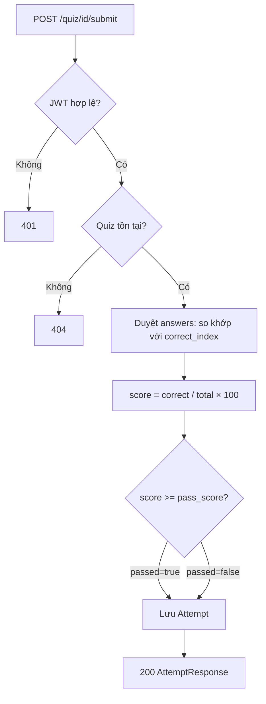

# Analysis and Design — Domain-Driven Design Approach

> **Tài liệu thay thế cho**: [`analysis-and-design.md`](analysis-and-design.md) (tiếp cận SOA/Erl).
> Tài liệu này phân tích LMS theo hướng DDD — phát hiện ranh giới service thông qua Domain Events thay vì phân rã quy trình.

**Tài liệu tham khảo:**
1. *Domain-Driven Design: Tackling Complexity in the Heart of Software* — Eric Evans
2. *Microservices Patterns: With Examples in Java* — Chris Richardson
3. *Bài tập — Phát triển phần mềm hướng dịch vụ* — Hung Dang

---

## Part 1 — Domain Discovery

### 1.1 Business Process Definition

- **Domain**: Giáo dục trực tuyến (E-Learning / LMS)
- **Business Process**: Học viên học qua video → ghi nhận tiến độ → kiểm tra kiến thức; Giáo viên tạo và quản lý nội dung khoá học
- **Actors**:
  - **Học viên (Student)**: học bài, theo dõi tiến độ, làm bài kiểm tra
  - **Giáo viên (Teacher)**: tạo khoá học, bài học, upload video, soạn bài kiểm tra
  - **Hệ thống (System)**: phát video streaming, chấm điểm tự động, lưu tiến độ
- **Scope**: Từ đăng ký tài khoản đến hoàn thành khoá học và nhận kết quả kiểm tra

**Process Diagram:**



---

### 1.2 Existing Automation Systems

> Không có — hệ thống được xây dựng mới hoàn toàn, không kế thừa legacy system nào.

| Hệ thống | Loại | Vai trò hiện tại | Phương thức tích hợp |
|----------|------|-----------------|----------------------|
| Không có | — | — | — |

---

### 1.3 Non-Functional Requirements

| Yêu cầu | Mô tả |
|---------|-------|
| **Hiệu năng** | Video streaming hỗ trợ HTTP 206 Range Request; API < 500ms |
| **Bảo mật** | JWT HS256, bcrypt, đáp án quiz ẩn hoàn toàn khỏi client |
| **Khả năng mở rộng** | Scale từng service độc lập; Progress Service scale theo lượng học viên đồng thời |
| **Tính sẵn sàng** | Health check trên mỗi service; Gateway retry tự động |
| **Rate limiting** | Auth: 10 req/phút; API chung: 60 req/phút |

---

## Part 2 — Strategic Domain-Driven Design

### 2.1 Event Storming — Domain Events

| # | Domain Event | Triggered By | Mô tả |
|---|-------------|--------------|-------|
| 1 | **UserRegistered** | Học viên / Giáo viên | Tài khoản mới được tạo trong hệ thống |
| 2 | **UserLoggedIn** | Học viên / Giáo viên | Xác thực thành công, JWT được phát hành |
| 3 | **UserProfileUpdated** | Học viên / Giáo viên | Họ tên hoặc mật khẩu được cập nhật |
| 4 | **CourseCreated** | Giáo viên | Khóa học mới được tạo (trạng thái: bản nháp) |
| 5 | **CoursePublished** | Giáo viên | Khóa học được đánh dấu công khai, học viên thấy được |
| 6 | **CourseUpdated** | Giáo viên | Thông tin khóa học được chỉnh sửa |
| 7 | **CourseDeleted** | Giáo viên | Khóa học bị xóa khỏi hệ thống |
| 8 | **LessonCreated** | Giáo viên | Bài học mới được thêm vào khóa học |
| 9 | **VideoUploaded** | Giáo viên | Video được tải lên và liên kết với bài học |
| 10 | **LessonDeleted** | Giáo viên | Bài học và file video bị xóa |
| 11 | **LessonProgressUpdated** | Học viên (tự động) | Tiến độ xem video được lưu (mỗi 10 giây) |
| 12 | **LessonCompleted** | Học viên | Học viên xem đến ≥ 95% video bài học |
| 13 | **QuizCreated** | Giáo viên | Bài kiểm tra với câu hỏi được tạo |
| 14 | **QuizSubmitted** | Học viên | Học viên nộp bài với các đáp án đã chọn |
| 15 | **QuizGraded** | Hệ thống | Bài kiểm tra được chấm điểm tự động |
| 16 | **QuizPassed** | Hệ thống | Học viên đạt điểm tối thiểu của quiz |
| 17 | **QuizFailed** | Hệ thống | Học viên chưa đạt điểm yêu cầu |

---

### 2.2 Commands and Actors

| Command | Actor | Triggers Event(s) |
|---------|-------|-------------------|
| RegisterUser | Học viên / Giáo viên | UserRegistered |
| LoginUser | Học viên / Giáo viên | UserLoggedIn |
| UpdateProfile | Học viên / Giáo viên | UserProfileUpdated |
| CreateCourse | Giáo viên | CourseCreated |
| PublishCourse | Giáo viên | CoursePublished |
| UpdateCourse | Giáo viên | CourseUpdated |
| DeleteCourse | Giáo viên | CourseDeleted |
| CreateLesson | Giáo viên | LessonCreated |
| UploadVideo | Giáo viên | VideoUploaded |
| DeleteLesson | Giáo viên | LessonDeleted |
| UpdateLessonProgress | Học viên (tự động qua FE) | LessonProgressUpdated, LessonCompleted |
| CreateQuiz | Giáo viên | QuizCreated |
| SubmitQuiz | Học viên | QuizSubmitted → QuizGraded → QuizPassed / QuizFailed |
| DeleteQuiz | Giáo viên | QuizDeleted |

---

### 2.3 Aggregates

| Aggregate | Commands | Domain Events | Dữ liệu sở hữu |
|-----------|----------|---------------|----------------|
| **User** | RegisterUser, LoginUser, UpdateProfile | UserRegistered, UserLoggedIn, UserProfileUpdated | id, email, full_name, hashed_password, role |
| **Course** | CreateCourse, UpdateCourse, PublishCourse, DeleteCourse | CourseCreated, CourseUpdated, CoursePublished, CourseDeleted | id, title, description, teacher_id, teacher_name, is_published |
| **Lesson** | CreateLesson, UploadVideo, UpdateLesson, DeleteLesson | LessonCreated, VideoUploaded, LessonDeleted | id, course_id, title, description, video_path, video_url, order |
| **Progress** | UpdateLessonProgress | LessonProgressUpdated, LessonCompleted | user_id, lesson_id, course_id, status, progress_percent, last_position |
| **Quiz** | CreateQuiz, DeleteQuiz | QuizCreated, QuizDeleted | id, course_id, title, pass_score, questions[] |
| **Attempt** | SubmitQuiz | QuizSubmitted, QuizGraded, QuizPassed, QuizFailed | id, quiz_id, user_id, answers{}, score, passed, submitted_at |

---

### 2.4 Bounded Contexts

| Bounded Context | Aggregates | Trách nhiệm |
|-----------------|------------|-------------|
| **Identity & Access** | User | Xác thực, phân quyền, quản lý tài khoản |
| **Course Management** | Course, Lesson | Quản lý nội dung khoá học và bài giảng video |
| **Learning Progress** | Progress | Theo dõi tiến độ học tập của học viên |
| **Assessment** | Quiz, Attempt | Kiểm tra kiến thức và chấm điểm tự động |

---

### 2.5 Context Map



**Các kiểu quan hệ:**

| Upstream | Downstream | Kiểu quan hệ | Mô tả |
|----------|------------|--------------|-------|
| Identity & Access | Course Management | Open Host Service (OHS) | Mỗi service tự decode JWT bằng shared secret |
| Identity & Access | Learning Progress | Open Host Service (OHS) | JWT payload chứa `user_id` dùng để lọc tiến độ |
| Identity & Access | Assessment | Open Host Service (OHS) | JWT payload chứa `user_id` dùng cho Attempt |
| Course Management | Learning Progress | Customer/Supplier | Progress cần `course_id` từ Lesson context |
| Course Management | Assessment | Customer/Supplier | Quiz thuộc về một Course |

---

## Part 3 — Service-Oriented Design

### 3.1 Uniform Contract Design

Tất cả service dùng `Content-Type: application/json` và trả lỗi dạng:
```json
{ "detail": { "error": "Mô tả lỗi" } }
```

**Auth Service:**

| Endpoint | Method | Media Type | Response Codes |
|----------|--------|------------|----------------|
| `/auth/register` | POST | `application/json` | 201, 400 |
| `/auth/login` | POST | `application/json` | 200, 401 |
| `/auth/logout` | POST | `application/json` | 200, 401 |
| `/auth/me` | GET/PUT | `application/json` | 200, 401, 422 |
| `/auth/validate` | GET | `application/json` | 200, 401 |
| `/auth/users` | GET | `application/json` | 200, 401, 403 |

**Course Service:**

| Endpoint | Method | Media Type | Response Codes |
|----------|--------|------------|----------------|
| `/courses` | GET/POST | `application/json` | 200, 201, 401, 403 |
| `/courses/{id}` | GET/PUT/DELETE | `application/json` | 200, 204, 401, 403, 404 |

**Lesson Service:**

| Endpoint | Method | Media Type | Response Codes |
|----------|--------|------------|----------------|
| `/lessons/course/{id}` | GET | `application/json` | 200 |
| `/lessons/{id}` | GET/PUT/DELETE | `application/json` | 200, 204, 401, 403, 404 |
| `/lessons/{id}/upload` | POST | `multipart/form-data` | 200, 400, 401 |
| `/lessons/{id}/stream` | GET | `video/*` | 206, 404 |

**Progress Service:**

| Endpoint | Method | Media Type | Response Codes |
|----------|--------|------------|----------------|
| `/progress/lesson/{id}` | GET/PUT | `application/json` | 200, 401, 404 |
| `/progress/course/{id}` | GET | `application/json` | 200, 401 |
| `/progress/continue` | GET | `application/json` | 200, 401 |

**Quiz Service:**

| Endpoint | Method | Media Type | Response Codes |
|----------|--------|------------|----------------|
| `/quiz/course/{id}` | GET | `application/json` | 200 |
| `/quiz/{id}` | GET/DELETE | `application/json` | 200, 204, 401, 403, 404 |
| `/quiz` | POST | `application/json` | 201, 401, 403 |
| `/quiz/{id}/submit` | POST | `application/json` | 200, 400, 401, 404 |
| `/quiz/{id}/attempts` | GET | `application/json` | 200, 401 |

---

### 3.2 Service Logic Design

**Identity & Access — Đăng nhập:**



**Course Management — Upload Video:**



**Learning Progress — Upsert tiến độ:**



**Assessment — Chấm điểm tự động:**


