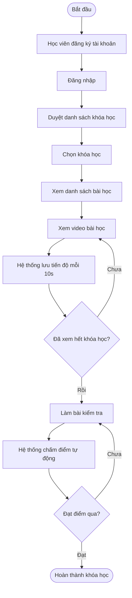
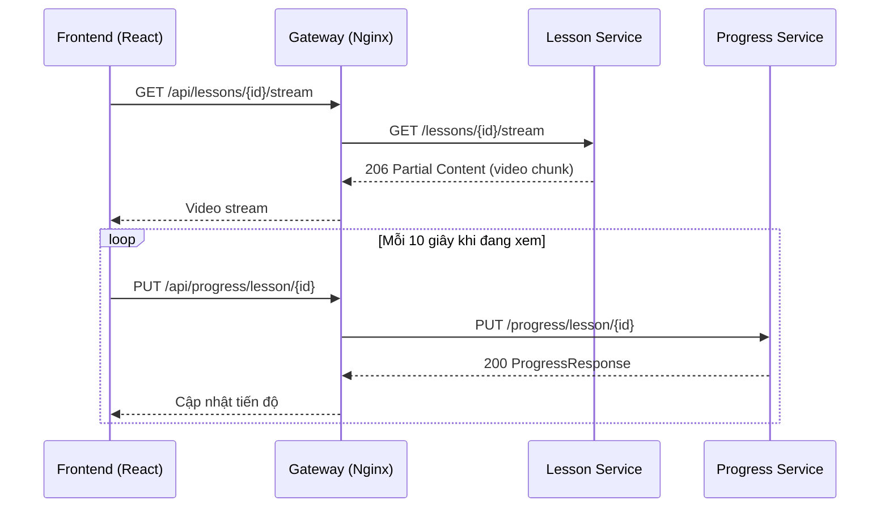
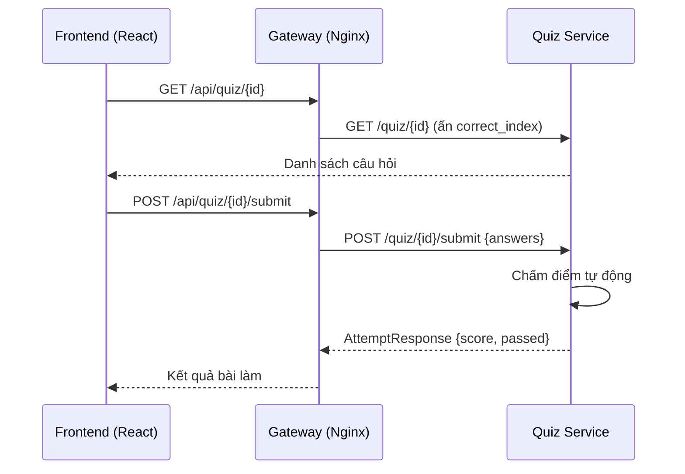
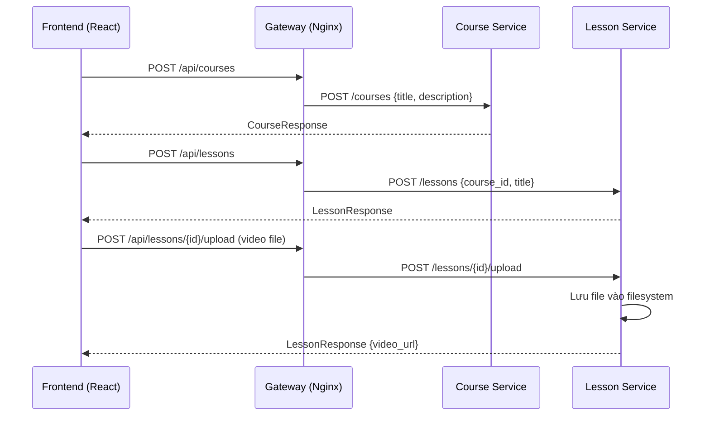
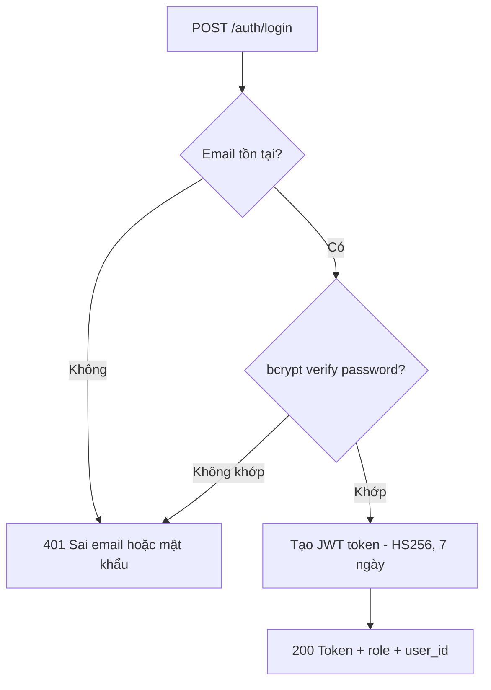
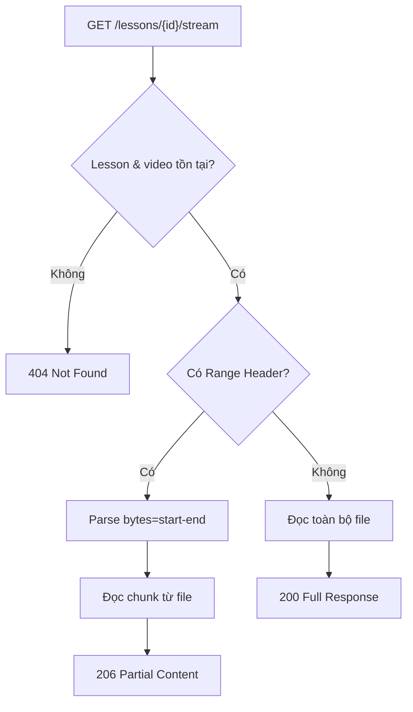
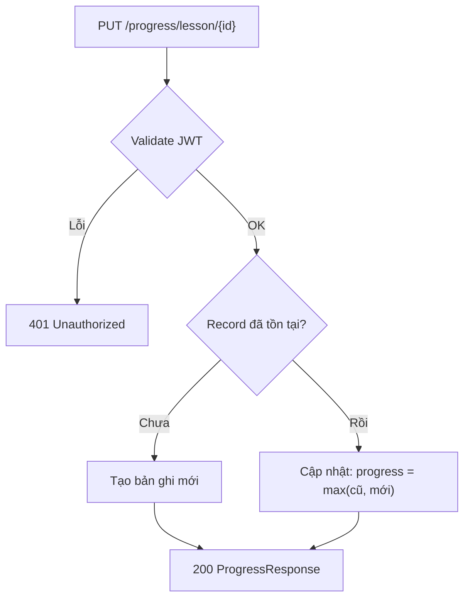
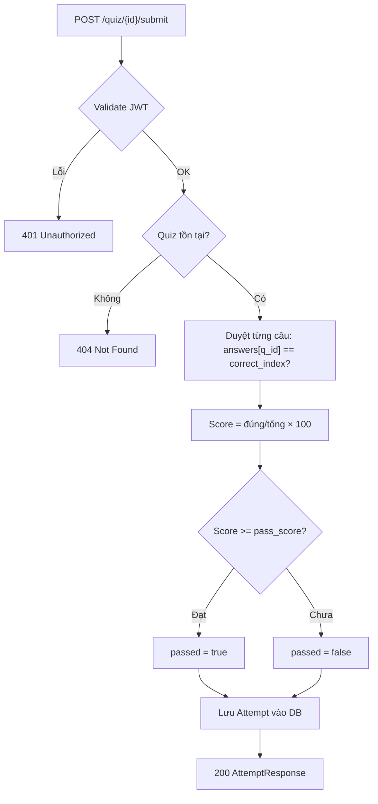

# Analysis and Design — Business Process Automation Solution

> **Goal**: Phân tích quy trình học trực tuyến và thiết kế giải pháp tự động hóa theo hướng Microservices.
> Phạm vi: hệ thống LMS (Learning Management System) hỗ trợ đăng ký khóa học, xem bài giảng video, theo dõi tiến độ và kiểm tra kiến thức.

**Tài liệu tham khảo:**
1. *Service-Oriented Architecture: Analysis and Design for Services and Microservices* — Thomas Erl (2nd Edition)
2. *Microservices Patterns: With Examples in Java* — Chris Richardson
3. *Bài tập — Phát triển phần mềm hướng dịch vụ* — Hung Dang

---

## Part 1 — Analysis Preparation

### 1.1 Business Process Definition

- **Domain**: Giáo dục trực tuyến (E-Learning / LMS)
- **Business Process**: Học viên đăng ký nền tảng → duyệt khóa học → học bài học qua video → theo dõi tiến độ → làm bài kiểm tra → nhận kết quả
- **Actors**:
  - **Học viên (Student)**: đăng ký, xem bài học, làm bài kiểm tra
  - **Giáo viên (Teacher)**: tạo khóa học, đăng bài học, upload video, tạo bài kiểm tra
  - **Hệ thống (System)**: chấm điểm tự động, lưu tiến độ
- **Scope**: Quản lý toàn bộ vòng đời học tập từ đăng ký đến hoàn thành khóa học

**Process Diagram:**

---

### 1.2 Existing Automation Systems

> Không có — hệ thống được xây dựng mới từ đầu, quy trình trước đây được thực hiện thủ công hoặc qua các nền tảng bên thứ ba.

| Hệ thống | Loại | Vai trò hiện tại | Phương thức tích hợp |
|----------|------|-----------------|----------------------|
| Không có | — | — | — |

---

### 1.3 Non-Functional Requirements

| Yêu cầu | Mô tả |
|---------|-------|
| **Hiệu năng** | Video streaming phải hỗ trợ HTTP Range Request (tua không lag); API response < 500ms với phần lớn request |
| **Bảo mật** | Xác thực JWT stateless; mật khẩu lưu dưới dạng bcrypt hash; đáp án quiz không bao giờ trả về client |
| **Khả năng mở rộng** | Mỗi service độc lập, có thể scale riêng theo tải (VD: lesson-service scale khi nhiều học viên xem video) |
| **Tính sẵn sàng** | Health check `/health` trên mỗi service; gateway retry khi service lỗi thoáng qua |
| **Khả năng bảo trì** | Mỗi service có codebase, database và container riêng biệt |
| **Rate limiting** | Giới hạn 10 req/phút cho auth endpoint (chống brute-force), 60 req/phút cho API chung |

---

## Part 2 — REST/Microservices Modeling

### 2.1 Decompose Business Process & 2.2 Filter Unsuitable Actions

| # | Hành động | Actor | Mô tả | Phù hợp? |
|---|-----------|-------|-------|----------|
| 1 | Đăng ký tài khoản | Học viên / Giáo viên | Nhập thông tin, tạo tài khoản | Có |
| 2 | Đăng nhập | Học viên / Giáo viên | Xác thực và nhận JWT | Có |
| 3 | Cập nhật profile | Học viên / Giáo viên | Sửa tên, đổi mật khẩu | Có |
| 4 | Tạo khóa học | Giáo viên | Tạo tiêu đề, mô tả, trạng thái xuất bản | Có |
| 5 | Sửa / Xóa khóa học | Giáo viên | Cập nhật hoặc xóa khóa học | Có |
| 6 | Tạo bài học | Giáo viên | Tạo bài học với tiêu đề, mô tả, thứ tự | Có |
| 7 | Upload video | Giáo viên | Tải video lên server, lưu đường dẫn | Có |
| 8 | Stream video | Học viên | Phát video qua HTTP Range Request | Có |
| 9 | Lưu tiến độ xem | Hệ thống | Ghi nhận vị trí và % xem mỗi 10 giây | Có |
| 10 | Xem tiến độ khóa học | Học viên | Tổng hợp % hoàn thành theo khóa học | Có |
| 11 | Tạo bài kiểm tra | Giáo viên | Tạo quiz với nhiều câu hỏi, điểm qua | Có |
| 12 | Làm bài kiểm tra | Học viên | Chọn đáp án và nộp bài | Có |
| 13 | Chấm điểm tự động | Hệ thống | So sánh đáp án, trả về điểm và kết quả | Có |
| 14 | Quyết định sư phạm | Giáo viên | Quyết định nội dung bài giảng là phù hợp | Không (con người) |
| 15 | Hỗ trợ học viên 1-1 | Giáo viên | Giải đáp thắc mắc cá nhân | Không (con người) |

---

### 2.3 Entity Service Candidates

| Thực thể | Service Candidate | Hành động Agnostic |
|----------|-------------------|--------------------|
| User | **Auth Service** | Đăng ký, đăng nhập, lấy profile, cập nhật profile, validate token |
| Course | **Course Service** | Tạo/sửa/xóa/lấy khóa học, lọc theo trạng thái |
| Lesson | **Lesson Service** | Tạo/sửa/xóa bài học, upload video, stream video |
| Progress | **Progress Service** | Lưu/lấy tiến độ bài học, tổng hợp tiến độ khóa học, bài học dở dang |
| Quiz / Question / Attempt | **Quiz Service** | Tạo/xóa quiz, lấy câu hỏi, nộp bài, chấm điểm, lịch sử |

---

### 2.4 Task Service Candidate

| Hành động không agnostic | Task Service Candidate |
|--------------------------|----------------------|
| Luồng "học viên hoàn thành khóa học" (xem video → lưu tiến độ → làm quiz) | Luồng này được Frontend orchestrate thông qua Gateway — không cần Task Service riêng |

> Trong kiến trúc này, Frontend đóng vai trò orchestrator: gọi tuần tự Lesson Service → Progress Service → Quiz Service. Không có Task Service tập trung.

---

### 2.5 Identify Resources

| Thực thể / Quy trình | Resource URI |
|----------------------|--------------|
| Tài khoản người dùng | `/api/auth/register`, `/api/auth/login`, `/api/auth/me` |
| Xác thực token | `/api/auth/validate`, `/api/auth/logout` |
| Danh sách người dùng | `/api/auth/users` |
| Khóa học | `/api/courses`, `/api/courses/{id}` |
| Bài học | `/api/lessons/course/{id}`, `/api/lessons/{id}` |
| Video bài học | `/api/lessons/{id}/upload`, `/api/lessons/{id}/stream` |
| Tiến độ bài học | `/api/progress/lesson/{id}` |
| Tiến độ khóa học | `/api/progress/course/{id}` |
| Tiếp tục học | `/api/progress/continue` |
| Bài kiểm tra | `/api/quiz/course/{id}`, `/api/quiz/{id}` |
| Nộp bài kiểm tra | `/api/quiz/{id}/submit` |
| Lịch sử làm bài | `/api/quiz/{id}/attempts` |

---

### 2.6 Associate Capabilities with Resources and Methods

| Service Candidate | Capability | Resource | HTTP Method |
|-------------------|------------|----------|-------------|
| Auth Service | Đăng ký | `/api/auth/register` | POST |
| Auth Service | Đăng nhập | `/api/auth/login` | POST |
| Auth Service | Đăng xuất | `/api/auth/logout` | POST |
| Auth Service | Xem profile | `/api/auth/me` | GET |
| Auth Service | Cập nhật profile | `/api/auth/me` | PUT |
| Auth Service | Validate token | `/api/auth/validate` | GET |
| Auth Service | Danh sách users | `/api/auth/users` | GET |
| Course Service | Xem khóa học | `/api/courses` | GET |
| Course Service | Tạo khóa học | `/api/courses` | POST |
| Course Service | Sửa khóa học | `/api/courses/{id}` | PUT |
| Course Service | Xóa khóa học | `/api/courses/{id}` | DELETE |
| Lesson Service | Xem bài học | `/api/lessons/course/{id}` | GET |
| Lesson Service | Tạo bài học | `/api/lessons` | POST |
| Lesson Service | Upload video | `/api/lessons/{id}/upload` | POST |
| Lesson Service | Stream video | `/api/lessons/{id}/stream` | GET |
| Lesson Service | Xóa bài học | `/api/lessons/{id}` | DELETE |
| Progress Service | Lưu tiến độ | `/api/progress/lesson/{id}` | PUT |
| Progress Service | Tiến độ khóa học | `/api/progress/course/{id}` | GET |
| Progress Service | Tiếp tục học | `/api/progress/continue` | GET |
| Quiz Service | Xem quiz | `/api/quiz/course/{id}` | GET |
| Quiz Service | Tạo quiz | `/api/quiz` | POST |
| Quiz Service | Nộp bài | `/api/quiz/{id}/submit` | POST |
| Quiz Service | Lịch sử | `/api/quiz/{id}/attempts` | GET |
| Quiz Service | Xóa quiz | `/api/quiz/{id}` | DELETE |

---

### 2.7 Utility Service & Microservice Candidates

| Candidate | Loại | Lý do |
|-----------|------|-------|
| **API Gateway (Nginx)** | Utility | Routing tập trung, CORS, rate limiting, gzip, logging — cross-cutting concern cho toàn hệ thống |
| **Auth Service** | Microservice | Yêu cầu bảo mật cao, tần suất gọi lớn (mỗi request cần validate JWT), cần scale độc lập |
| **Lesson Service** | Microservice | Video streaming đặc thù (HTTP Range, buffer off, timeout 3600s) — cần cấu hình riêng, không ảnh hưởng service khác |
| **Progress Service** | Microservice | Tần suất write rất cao (mỗi 10s/học viên đang xem) — cần scale và tối ưu DB riêng |

---

### 2.8 Service Composition Candidates

**Luồng: Học viên xem bài học và lưu tiến độ**

**Luồng: Học viên làm bài kiểm tra**

**Luồng: Giáo viên tạo khóa học và bài học**

---

## Part 3 — Service-Oriented Design

### 3.1 Uniform Contract Design

**Auth Service** — `application/json` cho tất cả endpoints

| Endpoint | Method | Media Type | Response Codes |
|----------|--------|------------|----------------|
| `/auth/register` | POST | `application/json` | 201, 400 |
| `/auth/login` | POST | `application/json` | 200, 401 |
| `/auth/logout` | POST | `application/json` | 200, 401 |
| `/auth/me` | GET | `application/json` | 200, 401 |
| `/auth/me` | PUT | `application/json` | 200, 401, 422 |
| `/auth/validate` | GET | `application/json` | 200, 401 |
| `/auth/users` | GET | `application/json` | 200, 401, 403 |

**Course Service**

| Endpoint | Method | Media Type | Response Codes |
|----------|--------|------------|----------------|
| `/courses` | GET | `application/json` | 200 |
| `/courses/all` | GET | `application/json` | 200, 401, 403 |
| `/courses/{id}` | GET | `application/json` | 200, 404 |
| `/courses` | POST | `application/json` | 201, 401, 403 |
| `/courses/{id}` | PUT | `application/json` | 200, 401, 403, 404 |
| `/courses/{id}` | DELETE | — | 204, 401, 403, 404 |

**Lesson Service**

| Endpoint | Method | Media Type | Response Codes |
|----------|--------|------------|----------------|
| `/lessons/course/{id}` | GET | `application/json` | 200 |
| `/lessons/{id}` | GET | `application/json` | 200, 404 |
| `/lessons` | POST | `application/json` | 201, 401, 403 |
| `/lessons/{id}/upload` | POST | `multipart/form-data` | 200, 400, 401, 403, 404 |
| `/lessons/{id}/stream` | GET | `video/*` (Range) | 206, 404 |
| `/lessons/{id}` | PUT | `application/json` | 200, 401, 403, 404 |
| `/lessons/{id}` | DELETE | — | 204, 401, 403, 404 |

**Progress Service**

| Endpoint | Method | Media Type | Response Codes |
|----------|--------|------------|----------------|
| `/progress/lesson/{id}` | GET | `application/json` | 200, 401, 404 |
| `/progress/lesson/{id}` | PUT | `application/json` | 200, 401 |
| `/progress/course/{id}` | GET | `application/json` | 200, 401 |
| `/progress/continue` | GET | `application/json` | 200, 401 |
| `/progress/all` | GET | `application/json` | 200, 401 |

**Quiz Service**

| Endpoint | Method | Media Type | Response Codes |
|----------|--------|------------|----------------|
| `/quiz/course/{id}` | GET | `application/json` | 200 |
| `/quiz/{id}` | GET | `application/json` | 200, 404 |
| `/quiz` | POST | `application/json` | 201, 401, 403 |
| `/quiz/{id}/submit` | POST | `application/json` | 200, 400, 401, 404 |
| `/quiz/{id}/attempts` | GET | `application/json` | 200, 401 |
| `/quiz/{id}` | DELETE | — | 204, 401, 403, 404 |

---

### 3.2 Service Logic Design

**Auth Service — Luồng đăng nhập:**

**Lesson Service — Luồng stream video:**

**Progress Service — Luồng upsert tiến độ:**

**Quiz Service — Luồng nộp bài và chấm điểm:**

