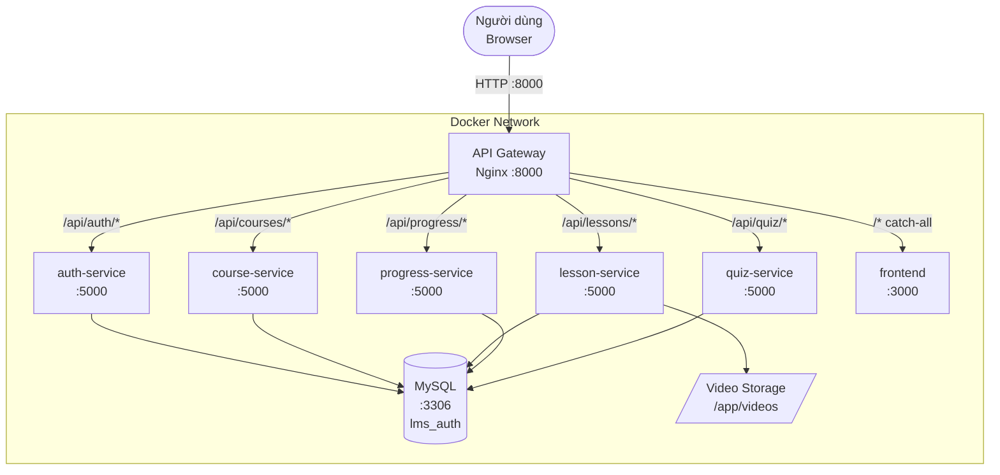
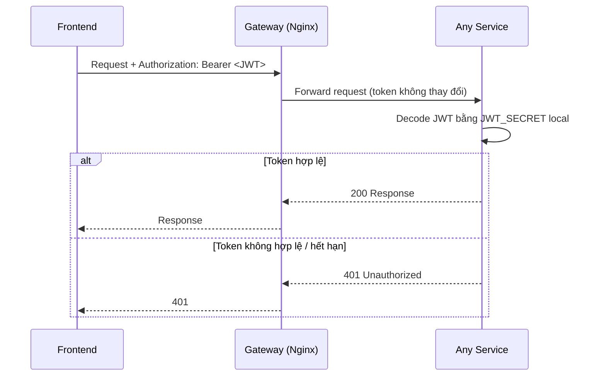

# System Architecture

> Tài liệu kiến trúc hệ thống LMS (Learning Management System) — xây dựng theo hướng Microservices.
> Dựa trên các Service Candidates và Non-Functional Requirements được xác định trong [Analysis and Design](analysis-and-design.md).

**Tài liệu tham khảo:**
1. *Service-Oriented Architecture: Analysis and Design for Services and Microservices* — Thomas Erl (2nd Edition)
2. *Microservices Patterns: With Examples in Java* — Chris Richardson
3. *Bài tập — Phát triển phần mềm hướng dịch vụ* — Hung Dang

---

## 1. Pattern Selection

| Pattern | Áp dụng? | Lý do kỹ thuật / nghiệp vụ |
|---------|----------|----------------------------|
| **API Gateway** | Có | Nginx tập trung routing, CORS, rate limiting, gzip, logging — tránh lặp lại cross-cutting concern ở mỗi service |
| **Database per Service** | Có | Mỗi service có schema riêng (bảng riêng trong cùng MySQL instance) — loose coupling, tự do thay đổi schema |
| **Shared Database** | Một phần | Dùng cùng MySQL instance (dev environment) nhưng mỗi service dùng database riêng biệt về mặt logic |
| **Stateless JWT Auth** | Có | JWT được decode cục bộ ở mỗi service bằng shared secret — không cần gọi auth-service để validate |
| **Saga** | Không | Không có giao dịch phân tán cần rollback — các luồng nghiệp vụ độc lập |
| **Event-driven / Message Queue** | Không | Không cần eventual consistency — các service giao tiếp đồng bộ qua HTTP, đủ cho quy mô này |
| **CQRS** | Không | Không cần tách read/write — lượng dữ liệu và tải trong phạm vi assignment |
| **Circuit Breaker** | Không | Nginx `proxy_next_upstream` xử lý retry cơ bản — Circuit Breaker phức tạp hơn mức cần thiết |
| **Service Registry / Discovery** | Không | Docker Compose DNS đủ dùng — service name là hostname, không cần Consul/Eureka |
| **HTTP Range Request (Video)** | Có | Lesson Service trả về HTTP 206 Partial Content để hỗ trợ tua video (seek) không cần reload |
| **Upsert (Progress)** | Có | Progress Service dùng insert-or-update idempotent — an toàn khi FE gọi nhiều lần |

---

## 2. System Components

| Component | Trách nhiệm | Tech Stack | Port nội bộ |
|-----------|-------------|------------|-------------|
| **Frontend** | Giao diện học viên và giáo viên | React 19, TypeScript, Tailwind CSS v4, Vite | 3000 |
| **Gateway** | Routing, rate limiting, CORS, gzip, logging | Nginx Alpine | **8000** (duy nhất expose ra host) |
| **auth-service** | Đăng ký, đăng nhập, JWT, quản lý tài khoản | Python 3.12, FastAPI, MySQL | 5001 |
| **course-service** | Quản lý khóa học (CRUD, phân quyền giáo viên) | Python 3.12, FastAPI, MySQL | 5002 |
| **lesson-service** | Quản lý bài học, upload & stream video | Python 3.12, FastAPI, MySQL, Filesystem | 5003 |
| **progress-service** | Theo dõi tiến độ học, upsert mỗi 10 giây | Python 3.12, FastAPI, MySQL | 5004 |
| **quiz-service** | Tạo quiz, chấm điểm tự động, lịch sử làm bài | Python 3.12, FastAPI, MySQL | 5005 |
| **MySQL** | Cơ sở dữ liệu quan hệ, mỗi service 1 database | MySQL 8 | 3306 |

> **Ghi chú về port:** Mỗi microservice chạy trên port riêng biệt trong Docker network (`auth-service:5001`, `course-service:5002`, ...). Gateway gọi đúng service qua hostname + port. Chỉ có **Gateway (port 8000)** được expose ra máy host — các service khác không trực tiếp truy cập được từ bên ngoài.


---

## 3. Communication

### Inter-service Communication Matrix

| From → To | auth | course | lesson | progress | quiz | Gateway | MySQL |
|-----------|------|--------|--------|----------|------|---------|-------|
| **Frontend** | Có (qua GW) | Có (qua GW) | Có (qua GW) | Có (qua GW) | Có (qua GW) | Có | Không |
| **Gateway** | Có (proxy) | Có (proxy) | Có (proxy) | Có (proxy) | Có (proxy) | — | Không |
| **auth-service** | — | Không | Không | Không | Không | Không | Có (`lms_auth`) |
| **course-service** | Không (JWT local) | — | Không | Không | Không | Không | Có (`lms_courses`) |
| **lesson-service** | Không (JWT local) | Không | — | Không | Không | Không | Có (`lms_lessons`) |
| **progress-service** | Không (JWT local) | Không | Không | — | Không | Không | Có (`lms_progress`) |
| **quiz-service** | Không (JWT local) | Không | Không | Không | — | Không | Có (`lms_quiz`) |

> **Ghi chú:** Các service **không gọi lẫn nhau** — mỗi service decode JWT độc lập bằng `JWT_SECRET` chung. Không có service-to-service HTTP call.

### Giao thức giao tiếp

| Luồng | Giao thức | Ghi chú |
|-------|-----------|---------|
| Frontend → Gateway | HTTP/1.1 | Tất cả request qua port 8000 |
| Gateway → Services | HTTP/1.1 + keepalive | `proxy_http_version 1.1`, keepalive 8 |
| Frontend dev → Gateway | HTTP proxy (Vite) | `vite.config.ts` proxy `/api` → `http://gateway:8000` |
| Lesson streaming | HTTP 206 Partial Content | Range Request, buffering off |

---

## 4. Architecture Diagram



### Luồng xác thực JWT



---

## 5. Data Architecture

Mỗi service sở hữu database riêng trong cùng MySQL instance:

| Service | Database | Bảng chính |
|---------|----------|-----------|
| auth-service | `lms_auth` | `users` |
| course-service | `lms_courses` | `courses` |
| lesson-service | `lms_lessons` | `lessons` |
| progress-service | `lms_progress` | `progress` |
| quiz-service | `lms_quiz` | `quizzes`, `questions`, `attempts` |

> **Quan hệ giữa các service** được giữ ở mức **ID references** (không có foreign key chéo schema). Ví dụ: `Progress.course_id` là string ID tham chiếu khóa học — không có FK thực sự sang `lms_courses`.

---

## 6. Deployment

```
mid-project/
├── docker-compose.yml      ← orchestration toàn bộ hệ thống
├── gateway/
│   ├── Dockerfile
│   └── nginx.conf          ← routing, rate limiting, gzip
├── frontend/
│   └── Dockerfile          ← Node build → Vite dev server
└── services/
    ├── auth-service/
    ├── course-service/
    ├── lesson-service/
    ├── progress-service/
    └── quiz-service/
        └── Dockerfile      ← Python 3.12 slim + uvicorn
```

**Khởi động toàn bộ hệ thống:**
```bash
docker compose up --build
```

**Truy cập:**
- Ứng dụng: http://localhost:8000
- API: http://localhost:8000/api/...
- Gateway health: http://localhost:8000/api/health

**Biến môi trường dùng chung (`.env`):**

| Biến | Mô tả |
|------|-------|
| `MYSQL_ROOT_PASSWORD` | Mật khẩu root MySQL |
| `JWT_SECRET` | Shared secret cho tất cả service |
| `JWT_ALGORITHM` | `HS256` |
| `JWT_EXPIRE_MINUTES` | Thời gian hết hạn token (mặc định 10080 = 7 ngày) |
