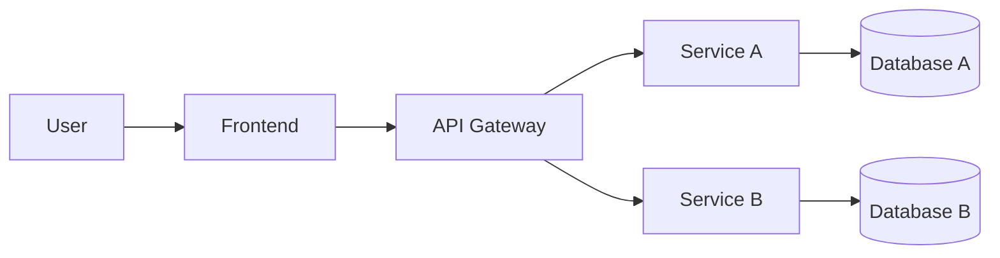

# 🏗️ System Architecture

## 1. Overview

Describe the purpose and high-level goals of your microservices system.

- What problem does it solve?
- Who are the target users?
- What are the key quality attributes (scalability, reliability, etc.)?

## 2. Architecture Style

Describe the architectural patterns and styles used:

- [ ] Microservices
- [ ] API Gateway pattern
- [ ] Event-driven / Message queue
- [ ] CQRS / Event Sourcing
- [ ] Database per service
- [ ] Saga pattern
- [ ] Other: ___

## 3. System Components

| Component     | Responsibility                          | Tech Stack       | Port  |
|---------------|----------------------------------------|------------------|-------|
| **Frontend**  | User interface                         | *(your choice)*  | 3000  |
| **Gateway**   | API routing, auth, rate limiting       | *(your choice)*  | 8080  |
| **Service A** | *(describe domain)*                    | *(your choice)*  | 5001  |
| **Service B** | *(describe domain)*                    | *(your choice)*  | 5002  |
| **Database**  | *(persistent storage)*                 | *(your choice)*  | 5432  |

## 4. Communication Patterns

Describe how services communicate:

- **Synchronous**: REST API / gRPC between services
- **Asynchronous**: Message queue (RabbitMQ, Kafka, Redis Pub/Sub)
- **Service Discovery**: Docker Compose DNS / Consul / etc.

### Inter-service Communication Matrix

| From → To     | Service A | Service B | Gateway | Database |
|---------------|-----------|-----------|---------|----------|
| **Frontend**  |           |           | REST    |          |
| **Gateway**   | REST      | REST      |         |          |
| **Service A** |           | *(?)* |         | SQL      |
| **Service B** | *(?)* |           |         | SQL      |

## 5. Data Flow

Describe the typical request flow:

```
User → Frontend → Gateway → Service A → Database
                          → Service B → Database
```

## 6. Architecture Diagram

> Place your diagrams in `docs/asset/` and reference them here.
>
> Recommended tools: draw.io, Mermaid, PlantUML, Excalidraw




## 7. Deployment

- All services containerized with Docker
- Orchestrated via Docker Compose
- Single command: `docker compose up --build`

## 8. Scalability & Fault Tolerance

- How can individual services scale independently?
- What happens when a service goes down?
- Are there retry mechanisms or circuit breakers?
- How is data consistency maintained across services?